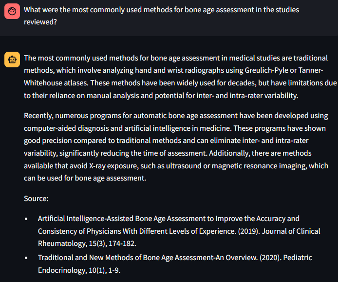

# Pubmed QA System

A user-friendly QA system designed to answer questions on medical data concerning intelligence from Pubmed abstracts.  

**Team Members**
- Cristi Andrei Prioteasa (cristi.prioteasa@stud.uni-heidelberg.de) - 4740844, Master Data and Computer Science, Heidelberg University.
- Mara-Eliana Popescu (mara-eliana.popescu@stud.uni-heidelberg.de) - 4166979, Master of Data and Computer Science, Heidelberg University.
- Alper Dağgez (ro312@stud.uni-heidelberg.de) - (matriculation number), Master of Data and Computer Science, Heidelberg University.

**Previous Team Member:** Tarik Mistura Arcoverde Cavalcanti

**Advisor:**
John Ziegler (ziegler@informatik.uni-heidelberg.de)

<!-- TABLE OF CONTENTS -->
<details>
  <summary>Table of Contents</summary>
  <ul>
    <li><a href="#getting-started">Getting Started</a></li>
    <li><a href="#introduction">Introduction</a></li>
    <li><a href="#related-work">Related Work</a></li>
    <li><a href="#methods">Methods</a></li>
    <li><a href="#experimental-setup-and-results">Experimental Setup and Results</a></li>
    <li><a href="#conclusions-and-future-work">Conclusions and Future Work</a></li>
  </ul>
</details>

## Getting Started
Use the following command to start the app:

```
conda env create -f environment.yml
python -m streamlit run src/streamlit_app.py
```

Note: the Ensemble Retriever (https://python.langchain.com/docs/modules/data_connection/retrievers/ensemble) used by the IR component (BM25 retriever + dense retriever) takes about 5 minutes to load some of the data in memory. This is because, by default, the langchain BM25 retriever can only hold the documents in memory and writing them to disk for retrieval is not trivial. After posing a question expect an inference time of 1-5 minutes.

## Introduction
With the recent advancements of Large Language Models (LLMs) interest in domain-specific applications powered by LLMs has increased. In particular, language models can assist experts in the medical domain most commonly by answering questions against a knowlegde base.

In this project, we implement a question answering system that takes in any queries regarding Pubmed abstracts related to the keyword "intelligence" from 2013 until 2023 and generates an answer in natural language.
Our system is based on a Retrieval Augmented Generation (RAG) pipeline, combining text retrieval from a vector database with the generative capabilities of a state-of-the-art LLM.
Furthermore, we evaluate the performance of our system by using a custom designed dataset.

The [Methods](#methods) section gives an extensive account of our approach covering especially data acquisition and preprocessing, embedding and storing of the corresponding vectors, document retrieval from a given query, answer generation and much more.

## Related Work

## Methods
Our pipeline consists of the following stages:
<ol>
  <li><a href="#data-acquisition">Data Acquisition</a></li>
  <li><a href="#chunking-and-vectorization">Chunking and Vectorization</a></li>
  <li><a href="#information-retrieval">Information Retrieval</a></li>
  <li><a href="#query-transformation">Query Transformation</a></li>
  <li><a href="#response-generation">Response Generation</a></li>
  <li><a href="#reference-sources">Reference Sources</a></li>
  <li><a href="#evaluation-methods">Evaluation Methods</a></li>
  <li><a href="#user-interface">User Interface</a></li>
</ol>

### Data Acquisition
As already mentioned in the introduction, the data we gathered consists of abstracts of Pubmed articles concerning intelligence, published between 2013 and 2023 [[Link](https://pubmed.ncbi.nlm.nih.gov/?term=intelligence+%5BTitle%2Fabstract%5D&filter=simsearch1.fha&filter=years.2014-2024&sort=date)].

We used the [Bio.Entrez](https://biopython.org/docs/1.75/api/Bio.Entrez.html) Python package to access the Pubmed database and scrape the targeted abstracts together with relevant metadata consisting of the title of the article, the date of publication and the list of authors.

The main challenge encountered at this stage was the fact that the underlying public NCBI Entrez API limits the number of retrieved articles to 10000. If you follow the link above you can see that over 60000 articles match our criteria. To overcome this limitation we used multiple API calls, each of them retrieving articles from different periods of time. We ensured that the prescribed periods of time do not yield more than 10000 articles. We exhaust the whole range from 2013 to 2023 without having overlapping between the different API calls. Overall, we managed to gather 69698 abstracts with the corresponding metadata.

We stored the data as a private HuggingFace dataset with the following data fields:
- `title`,
- `abstract`,
- `publication_date`: in the format DD/MM/YYYY,
- `id`: unique identifier for each article,
- `authors`: list of names.

The file [download_pubmed.py](src/download_pubmed.py) contains the whole pipeline for scraping the data and creating a local dataset in JSON format with the same data fields as our HuggingFace dataset.

### Chunking and Vectorization


To be able to perform both lexical and semantic search on the gathered data, we chunked each abstract, embedded each chunk and stored all embeddings in an index in Elasticsearch hosted on Elastic Cloud.

Our system uses the [PubMedBERT Embeddings](https://huggingface.co/NeuML/pubmedbert-base-embeddings) to vectorize the text chunks. This embedding model is particularly suitable to our task for various reasons:
- The model, based on [MSR BiomedBERT](https://huggingface.co/microsoft/BiomedNLP-BiomedBERT-base-uncased-abstract-fulltext) already pretrained on full Pubmed articles, was further finetuned using Pubmed title-abstract pairs.
- The embedding space is a 768 dimensional dense vector space, having a generous embedding dimensionality.

We experimented with a couple of chunking strategies employing the Langchain Text Splitters. Besides selecting the text splitter, we tried out different chunk sizes to find a good fit. The embedding model expects as input a sequence no longer than 512 tokens, thus limiting the chunk size. The following table shows all the combinations we used:

<!-- Use ✅ or  ❌ -->
| Text Splitter\Chunk Size | 50 | 100 | 200 | 400 |
|--------------------------|----|-----|-----|-----|
| [RecursiveCharacterTextSplitter](https://python.langchain.com/docs/modules/data_connection/document_transformers/recursive_text_splitter) |❌ | ❌ | ❌ | ✅ |
| [SentenceTransformersTokenTextSplitter](https://python.langchain.com/docs/modules/data_connection/document_transformers/split_by_token) | ✅ | ✅ | ✅ | ✅ |

For easy access to the vector database, irrespective of the machine on which our QA system is run we created an Elasticsearch instance on Elastic Cloud. Other reasons for choosing Elasticsearch were its compatibility with Langchain and the costs for maintaining the vector database.

Each index has the same underlying retrieval strategy, namely a [Hybrid ApproxRetrievalStrategy](https://python.langchain.com/docs/integrations/vectorstores/elasticsearch#approxretrievalstrategy), which uses a combination of approximate semantic search and keyword based search.
 
### Information Retrieval

The information retrieval component of our system is based on an [Ensemble Retriever](https://python.langchain.com/docs/modules/data_connection/retrievers/ensemble) combining the sparse retriever [BM25](https://python.langchain.com/docs/integrations/retrievers/bm25) with the hybrid retriever of our Elasticsearch index. The results of both retrievers are reranked using [Reciprocal Rank Fusion](https://plg.uwaterloo.ca/~gvcormac/cormacksigir09-rrf.pdf).
Since the hybrid retrieval strategy of our Elasticsearch index already combines lexical and semantic search, the resulting ensemble retriever emphasizes the lexical search, which is a preferred strategy in the medical field where certain keywords cannot be semantically approximated through other words.

Given an arbitrary query, our system retrieves the first $k=3$ documents that would be relevant for answer generation and passes them on to the generative component. 
We still need to experiment with the hyperparameter $k$.

One peculiarity we noticed while evaluating this component of our system is that duplicates appear among the retrieved documents. This behaviour becomes worse upon increasing $k$. To solve this problem, we used an [EmbeddingsRedundantFilter](https://api.python.langchain.com/en/latest/document_transformers/langchain_community.document_transformers.embeddings_redundant_filter.EmbeddingsRedundantFilter.html), which identifies similar documents and filters out redundant content.

### Query Transformation
The quality of the retrieved documents is also highly influenced by the quality of the query. Two problems that come up regarding the queries are that user questions may be poorly worded for retrieval or that the user questions may contain misleading or irrelevant information.

To address these problems, we adopted the [Rewrite-Retrieve-Read](https://arxiv.org/pdf/2305.14283.pdf?ref=blog.langchain.dev) approach to transform the user's query. To put it in a nutshell, our system first prompts a LLM to rewrite the query and then uses the rewritten query to retrieve relevant documents.

(Multi Query Retrieval ?)

### Response Generation

Currently, our system relies on OpenAI's model `gpt-3.5-turbo` to generate the answer using the rewritten query and the retrieved documents. In our experiments we also employed Meta's `llama2` model with 7B parameters and 4-bit quantization, provided through [Ollama](https://ollama.com/). In the end we settled for the former model to be able to host our QA system on [Streamlit Community Cloud](https://streamlit.io/cloud). If the user wants to test our system in a local environment, it is possible to switch from `gpt-3.5-turbo` to `llama2`. The two LLM's are comparable in terms of performance.

We faced certain problems at this stage of our project like resource limitations on our local machines or on Google Colab, nonavailability of certain packages or softwares on Windows systems (bitsandbytes, until recently Ollama as well), slow inference times both locally and on Google Colab before we started working with Ollama and OpenAI's API.

### Reference Sources 

Since the response generation relies on multiple documents, we deemed it necessary that our system accurately back-references the used sources. To this end we extended the prompt template to ask the generative LLM to cite the retrieved documents using the stored metadata. More specifically, each answer will contain at the end a list of sources as in the following example:



### Evaluation Methods


### User Interface

By using caching we were able to decrease the answer time from 15.785237812311 seconds to 3.9000279903411865 seconds

## Experimental Setup and Results
RAGAs validation metrics for Sentence Transformer 400 chunking, no ensemble retriever, read-write-retrieve query transformation, Chat GPT 3.5. Turbo for both the rewritter and generation part, pubmedbert embeddings.

{'answer_relevancy': 0.8942793135767543,
 'context_precision': 0.9253731342358208,
 'context_recall': 0.9253731343283582,
 'faithfulness': 0.825542328042328}

configuration,answer_relevancy,context_precision,context_recall
0,pubmedbert-sentence-transformer-100,0.8520767760246581,0.9253731342358208,0.9253731343283582

Influence of weight of ensemble retriever (weight of BM25 retriever). Only measured context_precision (asta are sens)

Might have fucked up the experiment

context_precision: 0.9200, 0.9200, 0.9200
BM25 retriever weight: 0.5, 0.7, 1

Inference time using llama2 (Ollama) on a RTX 3050 Ti 4 GB VRAM , 16 GB RAM, I7 10th generation, max_retrieved_docs = 50, used_tokens= 8295: 3 mins 53 seconds

## Conclusions and Future Work
